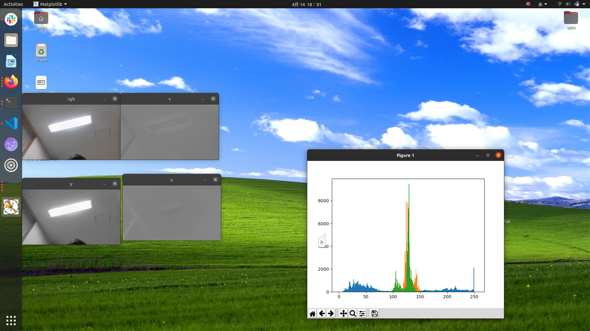

# リアルタイムYUV表示ツール

## 

## ツール説明

プロ実の授業でYUVのヒストグラムが安定した画像を撮影する必要があると聞いて作成しました。
カメラの入力をYUVの各要素に分解して表示することで、撮影対象のあたりをつけるのに役立ちます。
また、ヒストグラムの表示機能や撮影機能も保有します。
## 動作要件
OS : ubuntu18 以上
環境：python3 ,opencv2以上
## 使い方
### 起動
`python3 ./realtime_YUV.py`
### ヒストグラムの表示・更新
プレビューのウィンドウを選択した状態で`h`キーを長押し
### 撮影
プレビューのウィンドウを選択した状態で`c`キーを長押し
作業ディレクトリに`capture.png`という名前で画像が保存されます
### 終了
プレビューのウィンドウを選択した状態で`q`キーを長押し
# トラブルシューティング

- キー入力がきかない
 プレビューウィンドウが選択されていますか？
 ヒストグラムウィンドウが選択されている場合キー入力が動作しません

- 実行するとエラーが発生します
 python3とopencv,matplotlabは入っていますか？

- カメラの画像が表示されません
 パソコンにカメラはついていますか？
 パソコンにカメラがついていない場合はwebカメラをUSB接続してください

- 得られた画像ファイルが課題で要求された最大画素数より大きい
 ネットに転がっているツールでリサイズしてください

- 追加で欲しい機能がある
 issueで要望を出してください。
 複雑な機能の場合はラーメンを開発者におごってください
# 開発について
作者が改良する時間がないので基本的にはこのまま放置しますが、いい感じのプルリクをもらえればマージします。
# 免責事項
このツールの使用によるいかなる不利益・損害も